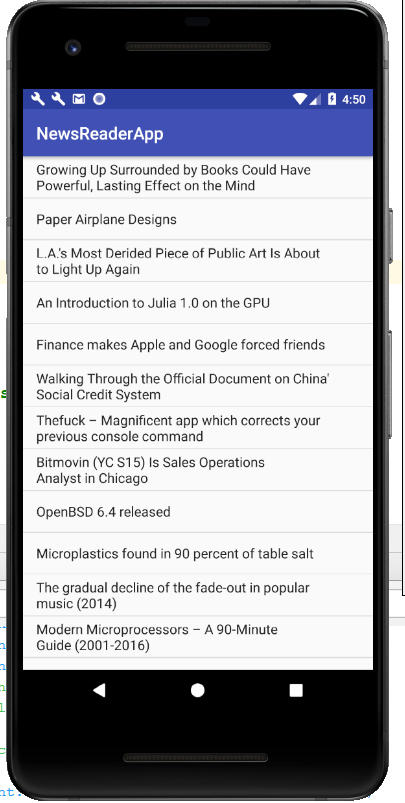

# NewsReader App

Uses the Hacker News API (https://github.com/HackerNews/API) to load the current trending web links from the site and display them to the user. The user can click on the links to load them. They can also drag down to refresh the list.

    
    

    

        
        

